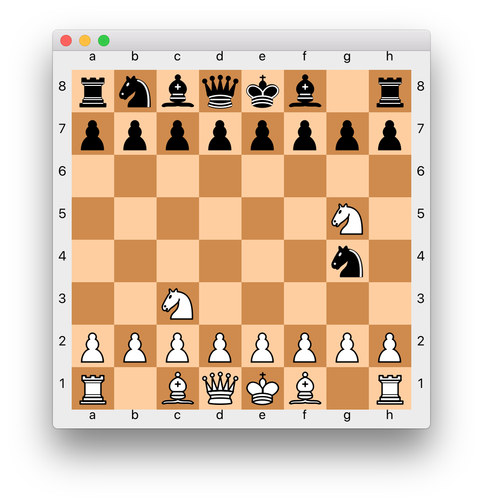

# ChessAI

Juan C. Torres

## Introduction

We want to implement an artificial intelligence player; to do so, we use various search algorithms, such as 
depth-limited minimax or alpha-beta search.

## Model and state representation

I implemented a generic depth-limited Chess AI class, `AIPlayer`, which contains the generic methods to get the score of 
the board, check whether a state is terminal, and so on. Specific details about alpha-beta search and minimax are 
implemented in their own classes, `AlphaBetaAI` and `MinimaxAI`.

The system state is represented by: 

1. the board, which contains 
information about each piece on the board as well as whose turn it is.

2. The current depth of recursion, so that we know when to stop searching deeper in the tree.

## Minimax and cutoff test

For minimax search, I implemented it following the pseudo-code as described in Russell and Norvig, p. 166:

```python
def minimax_decision(self, board: chess.Board, depth: int) -> chess.Move:
    possible_move_list = []
    for action in self.get_possible_moves(board):
        board.push(action)
        possible_move_list.append((action, self.min_value(board, depth + 1)))
        board.pop()
    # using key=... allows max to act like argmax
    action, score = max(possible_move_list, key=lambda action_and_val: action_and_val[1])
    return action

def max_value(self, board: chess.Board, depth) -> int:
    """
    Return the maximum value of the possible states explored from this node
    """
    # Update the max depth reached
    self.max_depth_reached = max(self.max_depth_reached, depth)
    self.minimax_calls += 1
    if self.terminal_test(board, depth):
        return self.get_board_score(board)
    val = float('-inf')
    for action in board.legal_moves:
        board.push(action)
        val = max(val, self.min_value(board, depth + 1))
        board.pop()
    return val

def min_value(self, board: chess.Board, depth) -> int:
    """
    Return the minimum value of the possible states explored from this node
    """
    # Update the max depth reached
    self.max_depth_reached = max(self.max_depth_reached, depth)
    self.minimax_calls += 1
    if self.terminal_test(board, depth):
        return self.get_board_score(board)
    val = float('inf')
    for action in self.get_possible_moves(board):
        board.push(action)
        val = min(val, self.max_value(board, depth + 1))
        board.pop()
    return val
    
def choose_move(self, board: chess.Board) -> chess.Move:
    self.minimax_calls = 0
    move = self.minimax_decision(board, 0)
    print('%s-Maximum depth reached: %d' % (self.color_string(), self.max_depth_reached))
    # calls to min_value and max_value, combined
    print('%s-Minimax calls: %d' % (self.color_string(), self.minimax_calls))
    return move
```

_Have the program print the number of calls it made to minimax as well as the maximum depth. Record your observations 
in your document._

I keep track of the number of calls made to `min_value` and `max_value` for each call to 
`minimax_decision`. The maximum depth reached is the maximum depth specified for the AI algorithm, as the `choose_move` 
always searches all the successor states of the current state. The number of calls made to `min_value` is usually in the
hundreds for `max_depth=2`, around 10,000 to 50,000+ for `max_depth=3`, and 200,000 to 700,000+ for `max_depth=4`, at which point
it becomes too slow for normal usage as it takes 20 or more seconds to return a move.

## Evaluation function

The evaluation function I implemented was based on the material value heuristic described in the book, using the 
following values, based on the suggestion by Russell and Norvig in p. 172; the value of the king is chosen on purpose 
as to be higher than weighted sum of all the other pieces, but not as high as `infinity`. This is done so that the AI agents
can still differentiate between different game-ending states. This could be useful, for instance, 
if the AI can choose to capture the opponent's king while loosing or not loosing its own queen.

* Pawn: 1
* Rook: 3
* Knight: 3
* Rook: 5
* Queen: 9
* King: 1000

The function I used is the weighted linear sum of the AI's own pieces minus the weighted linear sum of the opponent's 
pieces. By incorporating both its own and the opponent's piece values, we incentivize both defensive and offensive 
moves over neutral moves. 

Since the `python-chess` library does not generate capturing the king as a valid moves, we will never see the difference
between a checkmate and other moves with all other pieces being equal. Therefore, we must check manually whether we have 
reached a checkmate state. Furthermore, we need to differentiate between checkmates to the opponent and to our own AI.
Therefore, I add or subtract the material value of the king to the heuristic depending on which side gets checkmated:

```evaluation_function(state) = weighted_linear_sum(own pieces) - weighted_linear_sum(opponent's pieces) + checkmate score(state)```


## Iterative deepening

I implemented iterative-deepening using minimax. In order to re-use minimax without modification, I store the utility
value of move minimax returns in a field of `MinimaxAI` just before returning the move.

```python
def choose_move(self, board: chess.Board):
    move_best = None
    utility_val_best = float('-inf')
    for i in self.max_depth:
        minimax_search = MinimaxAI(i, self.color_own, self.shuffle_moves,
                                   use_transposition=self.use_transposition)
        move = minimax_search.choose_move(board)
        utility_val = minimax_search.utility_value
        if utility_val > utility_val_best:
            move_best = move
    return move_best
```
_Verify that for some start states, `best_move` changes (and hopefully improves) as deeper levels are searched._

We can see this when calling `minimax_search.choose_move` at depths 1, 2, and 3 for the following board: 


The returned values and moves for each of those follow:
```
[ITERATIVE MINIMAX]. Depth: 1. Utility: 1. Move: g4h2
[ITERATIVE MINIMAX]. Depth: 2. Utility: -1. Move: h8g8
[ITERATIVE MINIMAX]. Depth: 3. Utility: 1. Move: b8c6
```
We see that, as higher depths are explored, the AI changes its opinion about the best move available to it. Note that, 
even if the best move decreased, this reflects a more complete understanding of the game and the move discovered at a 
higher depth should be chosen still, as the lower score reflects that, once the previously promising move was further 
examined, it turned out not to be as good as the AI previously expected.

## Alpha-beta pruning

I implemented alpha-beta pruning by following the pseudo-code noted in Russell and Norvig, p. 170:

```python
def choose_move(self, board: chess.Board):
    return self.alpha_beta_search_with_transposition(board, 0)

def alpha_beta_search_with_transposition(self, board: chess.Board, depth) -> chess.Move:
    """
    Top level function for alpha-beta pruning.
    """
    possible_move_list = []
    for move in self.get_possible_moves(board):  # move re-ordering happens here, if specified
        # Simulate move
        board.push(move)
        # Calculate the score for this move
        if self.use_transposition:
            hashable_board = self.get_hashable_board(board)
            if hashable_board in self.transposition_table:
                score = self.transposition_table[hashable_board]
            else:
                score = self.min_value(board, depth + 1, -float(inf), float(inf))
                self.transposition_table[str(board)] = score
        else:
            score = self.min_value(board, depth + 1, -float(inf), float(inf))
        possible_move_list.append((move, score))
        # Done calculating score for this move. Undo!
        board.pop()
    best_move = max(possible_move_list, key=lambda move_and_score: move_and_score[1])
    return best_move[0]

def min_value(self, board, depth, alpha, beta) -> int:
    """
    Get the value of the WORST state for this AI from the successor nodes. In
    other words, get the best state for the opponent. Notice this method returns
    a numerical value, not a move.
    """
    if self.terminal_test(board, depth):
        return self.get_board_score(board)
    val = float('inf')
    for action in self.get_possible_moves(board):
        board.push(action)
        # Calculate score of this action
        if self.use_transposition:  # check if score previously calculated or calculate now
            hashable_board = self.get_hashable_board(board)
            if hashable_board in self.transposition_table:
                new_val = self.transposition_table[hashable_board]
            else:
                new_val = self.max_value(board, depth + 1, alpha, beta)
                self.transposition_table[hashable_board] = new_val
        else:  # calculate score every time
            new_val = self.max_value(board, depth + 1, alpha, beta)
        val = min(val, new_val)
        # Done calculating score. Undo move
        board.pop()
        if val <= alpha:
            return val
        beta = min(beta, val)
    return val

def max_value(self, board, depth, alpha, beta) -> int:
    """
    Get the value of the BEST state for this AI from the successor nodes.
    Notice this method returns a numerical value, not a move.
    """
    if self.terminal_test(board, depth):
        return self.get_board_score(board)
    val = float('-inf')
    legal_moves = self.get_possible_moves(board)
    for action in legal_moves:
        board.push(action)
        if self.use_transposition:
            hashable_board = self.get_hashable_board(board)
            if hashable_board in self.transposition_table:
                new_val = self.transposition_table[hashable_board]
            else:
                new_val = self.min_value(board, depth + 1, alpha, beta)
                self.transposition_table[hashable_board] = new_val
        else:
            new_val = self.min_value(board, depth + 1, alpha, beta)
        val = max(val, new_val)
        board.pop()
        if val >= beta:
            return val
        alpha = max(alpha, val)
    return val
```

The number of calls made to min_value is usually around 5,000 to 25,000 for `max_depth=3`,
around 40,000 to 150,000 for `max_depth=4`. We can see a significant improvement compared to simple minimax search.

_Show some results (briefly) in your document, demonstrating that for the same depth, for various positions, 
alpha-beta explored fewer nodes and yet gave a move (leading to a position satisfying the cut-off test) with the same value._

### Board 1
Using the following board, I compare alpha-beta and minimax. `MinimaxAI` calls the minimax function
15,044 times, whereas `AlphaBetaAI` calls minimax 2,484 times.
```
r n b q k b r .
p p p p p p p p
. . . . . . . .
. . . . . . N .
. . . . . . n .
. . . . . . . .
P P P P P P P P
R N B Q K B . R
----------------
a b c d e f g h
```

Both algorithms choose the same move, but alpha-beta cuts its search significantly earlier:

Alpha-beta:
```
Best move score: 1
BLACK-Maximum depth reached: 2
BLACK-Minimax calls: 2484
```

Minimax:
```
Best move score: 1
BLACK-Maximum depth reached: 3
BLACK-Minimax calls: 15044
```

The resulting board follows:

```
r n b q k b . r
p p p p p p p p
. . . . . . . .
. . . . . . N .
. . . . . . n .
. . . . . . . .
P P P P P P P P
R N B Q K B . R
```

### Board 2

```
r n b q k b . r
p p p p p p p p
. . . . . . . n
. . . . . . . .
P . . . . P . .
. P . . P . . P
R . P P . . P .
. N B Q K B N R
----------------
a b c d e f g h
```

Minimax:
```
Best move score: 0
BLACK-Maximum depth reached: 3
BLACK-Minimax calls: 14753
```

Alpha-beta:
```
Best move score: 0
BLACK-Maximum depth reached: 2
BLACK-Minimax calls: 2670
```

The resulting move in both cases:
```
r n b q k b r .
p p p p p p p p
. . . . . . . n
. . . . . . . .
P . . . . P . .
. P . . P . . P
R . P P . . P .
. N B Q K B N R
----------------
a b c d e f g h
```

### Board 3
```
r n b k . b . .
p p p q p p p r
. . . . . . . n
. . . . P . . .
P . . . . P . .
. P N P . N . P
R B P . . . P R
. . . K . . . .
----------------
a b c d e f g h
```

Alpha-beta:
```
Best move score: 13
BLACK-Maximum depth reached: 2
BLACK-Minimax calls: 11256
```
Minimax:
```
Best move score: 13
BLACK-Maximum depth reached: 3
BLACK-Minimax calls: 27863
```
Resulting move in both cases:

```
r n b k . b . .
p p p . p p p r
. . q . . . . n
. . . . P . . .
P . . . . P . .
. P N P . N . P
R B P . . . P R
. . . K . . . .
----------------
a b c d e f g h
```

We can see, then, that alpha-beta does find the correct score while significantly reducing the number of minimax function 
calls.

## Transposition table

I implemented a transposition table with a dictionary mapping board states to utility values. In order to hash the board,
I use the string function of the board. This code is found in the `AIPlayer` class:

```python
@staticmethod
def get_hashable_board(board):
    return str(board)
```

In particular, note the following code used in alpha-beta search, which checks whether a particular state is present in
the transposition table before searching for its value:

```python
if self.use_transposition:
    hashable_board = self.get_hashable_board(board)
    if hashable_board in self.transposition_table:
        new_val = self.transposition_table[hashable_board]
    else:
        new_val = self.min_value(board, depth + 1, alpha, beta)
        self.transposition_table[hashable_board] = new_val
else:
    new_val = self.min_value(board, depth + 1, alpha, beta)
```

When using alpha-beta search with a transposition table, even at `max_depth=4`, the number of minimax calls ranges from
somewhere between 3,000 and 17,000, which represents a significant improvement to regular alpha-beta search.

_Demonstrate that your code uses the transposition table to prevent some calls in minimax or alpha-beta, and discuss the 
number of calls made in your report._

### Board 1

```
r n b q k . r .
p p p p . p p p
. . . . . b . n
. . . . P . . .
P . . . . P P .
B P . . . . . P
R . P P . . . .
. N . . K B N R
----------------
a b c d e f g h
```
In this exact same board, alpha-beta calls minimax 638 times with a transposition table, whereas it calls minimax 672 
without one. The resulting move is the same:
```
r n b q k . r .
p p p p . p p p
. . . . . . . n
. . . . P . b .
P . . . . P P .
B P . . . . . P
R . P P . . . .
. N . . K B N R
----------------
a b c d e f g h
```

Alternatively, printing inside the minimax calls whether a board is found in the transposition table also shows when we 
do not have to recurse to find a board's value:

```
...
Board missing. Finding its value!
Board missing. Finding its value!
Board missing. Finding its value!
Board found!
Board missing. Finding its value!
Board found!
Board missing. Finding its value!
...
``` 

## Move reordering

I implemented move reordering based on the suggestions by Russell and Norvig in p. 169: I first consider the capturing 
moves, then the forward moves, then the remaining moves. I decided not to assign an intermediate value to threats since 
I found that to require too much computational time, as the AI would need to simulate the move, get all the opponents 
pieces and the pieces that can attack those to find out whether the move threatens the opponent, then undo the move.

When using move reodering with alpha-beta search, the number of minimax calls is reduced to about 400 to 4,000 for 
`max_depth=3`, 10,000 to 70,000 for `max_depth=4` without a transposition table and to about 2,000 to 15,000 with 
a transposition table.